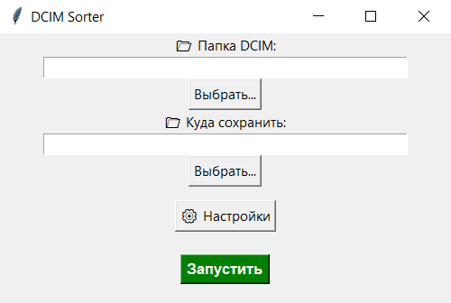
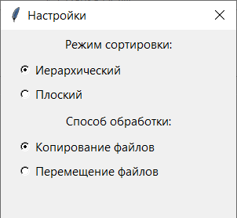
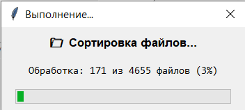

# 📂 DCIM Sorter

  
  
  
  

---

## 📌 Описание проекта

**DCIM Sorter** — десктопное приложение на Python для автоматической сортировки фотографий и видео по дате съёмки.

Программа предназначена для организации файлов (например, из папки `DCIM` смартфона), автоматически распределяя их по структурированным каталогам.

Дата определяется:
- из имени файла (если присутствует)
- либо по дате изменения файла

---

## 🚀 Основные возможности

### 🖥️ Интерфейс
- Графический интерфейс на **Tkinter**
- Выбор входной и выходной папки
- Окно настроек
- Прогресс-бар выполнения
- Защита от закрытия во время работы

### 📁 Работа с файлами
- Сортировка фото и видео по дате
- Поддержка популярных форматов (JPG, PNG, HEIC, MP4 и др.)
- Обработка вложенных папок

### ⚙️ Режимы
- Иерархический: `Год/Месяц/День`
- Плоский: `YYYY-MM-DD`
- Копирование или перемещение файлов

### 🧠 Надёжность
- Разрешение конфликтов имён
- Папка `_unsorted` для неподдерживаемых файлов
- Обработка ошибок без остановки программы

---

## ▶️ Запуск

### Основной запуск

Используйте один из файлов:

- `Run.vbs`
- `Run.bat`

Оба файла выполняют **одинаковый запуск программы**.

---

## 🧪 Тестирование

Для запуска тестов используйте:

- `Run Tests.bat`

Включены unit-тесты для проверки:
- логики сортировки
- обработки файлов
- вспомогательных функций

---

## 🖼️ Скриншоты

### Главное окно

### Окно настроек

### Процесс выполнения

---

## 📊 Результат работы

После выполнения:
- файлы распределяются по папкам по дате
- неподдерживаемые файлы попадают в `_unsorted`
- отображается статистика обработки

---

## 🧑‍💻 Автор

Разработано в рамках лабораторной работы.

👤 Автор: студент  
🤖 При участии: искусственного интеллекта (ChatGPT)

---

  <b>DCIM Sorter</b> — простой способ навести порядок в файлах 📁

